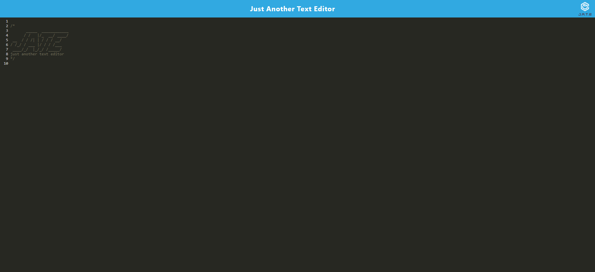

  
  # Just Another Text Editor

  ## Description

  A progressive web application text editor that you could install and even use offline!

  ## Table of Contents

  - [Installation](#installation)
  - [Usage](#usage)
  - [License](#license)
  - [Questions](#questions)

  ## Installation

  To install this project, use npmi. Then run npm run dev to start everything up. You may have to use npm i in both the client and server side directories as well.

  ## Usage

  I recommend that you use the heroku link in order to use this project.
  

  ## License

  This application is covered under the MIT license. Read more at [License: MIT](https://opensource.org/licenses/MIT)

  ## Questions

  1. Where can I find your github so that I can view your other projects? https://github.com/scicluna

  2. What email address should I use to contact you regarding further opportunities or questions? sciclunajl@gmail.com
